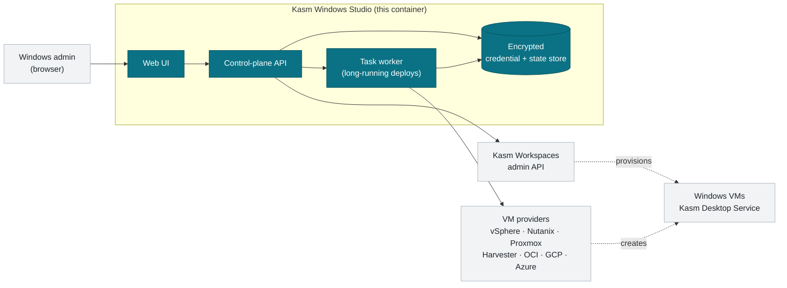

# Kasm Windows Studio

**A control plane for Kasm Windows Workspaces infrastructure.**

Kasm Windows Studio is a self-hosted web appliance that turns the multi-step, error-prone
work of standing up Windows workspace infrastructure — pools, autoscale groups, VM
providers, Desktop Service enrollment, RDP trust, persistent profiles — into a guided
wizard with audit logging.

You run it as a single container next to your existing Kasm Workspaces deployment. It
talks to the Kasm admin API on your behalf; it does not replace Kasm, sit in the session
path, or see user traffic.

> [!IMPORTANT]
> **Tech Preview.** This release is for evaluation in non-production environments.
> Interfaces and configuration may change between preview builds. See
> [Tech Preview scope](#tech-preview-scope) for what is and isn't included.

---

## Quick start

Three commands, assuming Docker and Docker Compose are already installed:

```bash
curl -fsSLO https://raw.githubusercontent.com/KasmInnovation/Kasm-windows-studio/main/docker/docker-compose.yml
curl -fsSL  https://raw.githubusercontent.com/KasmInnovation/Kasm-windows-studio/main/docker/.env.example -o .env
docker compose up -d
```

Then open **https://localhost:8443** and complete the first-run setup wizard.

Before you start, generate the master key that encrypts stored credentials — the
appliance will not start without it:

```bash
sed -i "s|APPLIANCE_MASTER_KEY=REPLACE_ME|APPLIANCE_MASTER_KEY=$(openssl rand -base64 32)|" .env
```

Full walkthrough: **[docs/quick-start.md](docs/quick-start.md)** ·
Production install: **[docs/installation.md](docs/installation.md)**

---

## What it does

| Capability | What it replaces |
| --- | --- |
| **Guided pool deployment** | Hand-sequencing pool → autoscale config → VM provider → workspace across four admin screens, in the right order, with the right IDs |
| **Multi-provider autoscale** | Per-provider consoles and bespoke scripts. One config, several providers, each on its own schedule |
| **Server enrollment tokens** | The per-server registration round-trip — create server, save, reopen, enable Desktop Service, save again |
| **Trust Profiles (KTP)** | Manual roaming-profile plumbing so users keep their desktop across disposable VMs |
| **RDP certificate & trust management** | Hand-built certificate chains and GPO exports for RDP client trust |
| **Connection profiles** | Per-workspace RDP/Guacamole connection settings maintained by hand |
| **Audit trail** | No record of who changed which piece of infrastructure, or when |

Supported VM providers in this preview: **VMware vSphere**, **Nutanix Prism**,
**Proxmox VE**, **Harvester**, **Oracle Cloud Infrastructure**, **Google Cloud**,
and **Azure Virtual Desktop**.

---

## How it fits together



The appliance is a **control plane only**. User sessions connect to Kasm and the Windows
VMs directly — Studio is not in the data path, and an outage affects administration, not
running sessions.

---

## Documentation

| Guide | What's in it |
| --- | --- |
| [Quick start](docs/quick-start.md) | Pull the container and deploy your first pool |
| [Installation](docs/installation.md) | Production install, sizing, TLS, Kasm API permissions, upgrades, backup |
| [Configuration](docs/configuration.md) | Every environment variable, with defaults |
| [Deployment workflows](docs/workflows.md) | The three workflows, with sequence diagrams |
| [Trust Profiles](docs/trust-profiles.md) | Persistent user profiles across disposable VMs |
| [Troubleshooting](docs/troubleshooting.md) | Symptoms, causes, and how to read the logs |
| [Business case & outcomes](docs/business-case.md) | Why this exists and what it's measured on |
| [Diagrams](diagrams/README.md) | Editable Mermaid sources for every diagram |

---

## Requirements

**Control plane host**

- Linux with Docker Engine 24+ and the Compose plugin
- 2 vCPU / 4 GB RAM / 20 GB disk minimum — 4 vCPU / 8 GB RAM / 50 GB recommended
- Network reach to your Kasm Workspaces API and to your VM provider endpoints

**Kasm Workspaces**

- An existing Kasm deployment you administer
- An API credential — see [the permission table](docs/installation.md#kasm-api-permissions)

**Windows guest templates**

- Windows Server 2019/2022 or Windows 10/11 Enterprise
- Guest tools installed, PowerShell 5.1+, execution policy `RemoteSigned` or `Bypass`

---

## Tech Preview scope

**Included and exercised in this preview**

- All three deployment workflows and the seven VM providers listed above
- Server enrollment tokens, Trust Profiles, connection profiles, certificate management
- Local administrator accounts with role-based permissions and audit logging

**Not included yet**

- **SSO for administrator login.** SAML and LDAP/AD configuration screens are present and
  the schema exists, but the authentication providers are not implemented in this
  preview. Use local accounts. (This is separate from Kasm's own per-session Windows
  account handling, which does work.)
- **External PostgreSQL.** SQLite is the only database driver shipped in the image.
- **High availability.** Single-instance only; no clustering or failover.

Preview builds are not covered by a production support SLA.

---

## Feedback

Please open an issue in this repository. Useful reports include the preview build you
are running (the `IMAGE_TAG` from your `.env`, or
`docker image inspect --format '{{index .RepoDigests 0}}' ghcr.io/kasminnovation/kasm-windows-studio:latest`),
what you expected, and what happened.

When attaching logs or screenshots, **redact hostnames, IP addresses, API keys and
usernames** — this is a public repository.

---

## License

> [!NOTE]
> Licensing for the Tech Preview is being finalised. Until a `LICENSE` file is added to
> this repository, treat the contents as "evaluation use, all rights reserved" and
> contact Kasm before redistributing.
