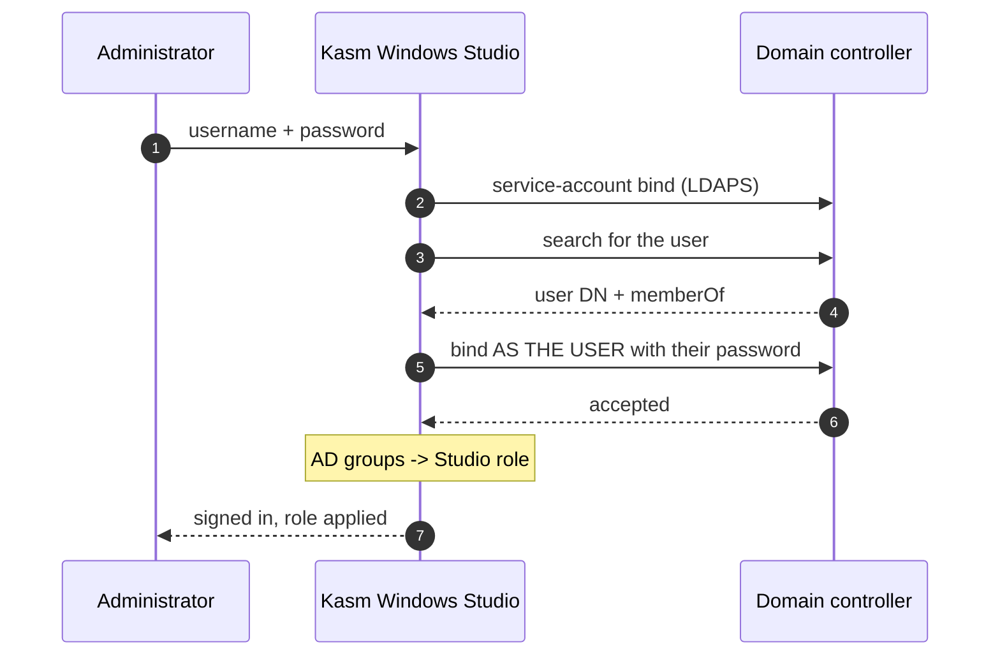

# Active Directory sign-in

Administrators sign in with their AD credentials, and their AD group membership decides
what they can do in Studio. No separate account per administrator, and access follows
your existing joiners/movers/leavers process.



The second bind is the actual password check — Studio never compares password hashes
itself, and never stores the user's password.

---

## Requirements

| | |
| --- | --- |
| **LDAPS** | Plain `ldap://` is **refused**. Credentials would cross the network in clear. |
| **A CA certificate** | Studio verifies the DC's certificate. Self-signed is fine if you supply the CA. |
| **A service account** | Read access to the user and group objects you care about. No write, no admin. |

---

## Configure

In **Settings → Active Directory** (or the first-run wizard's step 4):

| Field | Example | Notes |
| --- | --- | --- |
| Server URL | `ldaps://dc1.corp.example.com:636` | Must be `ldaps://`. The hostname must match the certificate. |
| Bind DN | `svc-kasmstudio@corp.example.com` | UPN or full DN both work. |
| Bind password | | Encrypted at rest with your `APPLIANCE_MASTER_KEY`. |
| Base DN | `DC=corp,DC=example,DC=com` | Where user searches start. |
| User filter | `(sAMAccountName={username})` | `{username}` is substituted and escaped. |

Then point Studio at the CA that signed your DC's certificate:

```bash
# in .env, next to docker-compose.yml
LDAP_CA_CERT_FILE=/etc/kasm-studio/ssl/corp-ca.pem
```

and mount it in:

```yaml
services:
  appliance:
    volumes:
      - ./corp-ca.pem:/etc/kasm-studio/ssl/corp-ca.pem:ro
```

Use **Test Connection** before saving. It exercises the service bind and a user lookup
and reports which step failed.

---

## Mapping groups to roles

Add mappings in the order you want them evaluated — **first match wins**.

| AD group | Studio role |
| --- | --- |
| `CN=KasmStudio-Admins,OU=Groups,DC=corp,DC=example,DC=com` | `admin` |
| `CN=KasmStudio-Operators,OU=Groups,DC=corp,DC=example,DC=com` | `operator` |
| `CN=KasmStudio-Auditors,OU=Groups,DC=corp,DC=example,DC=com` | `auditor` |

Either the full DN or the bare group name (`KasmStudio-Admins`) will match. You can map
a group to a **custom role** instead of a built-in one.

**A user in no mapped group gets `readonly`.** Mappings grant, they never revoke, so
put your most privileged group first — a user in both Admins and Operators takes
whichever appears higher in the list.

On first successful sign-in Studio creates a local shadow record for the user so audit
entries and role assignments have something to hang off. It holds no password.

---

## If the directory is unreachable

**By default, nobody signs in via AD.** That is deliberate: the alternative is falling
back to local passwords, which would let an account you disabled in AD keep working.

```bash
LDAP_STRICT_MODE=true    # default. Directory down = AD sign-in unavailable.
```

Setting it to `false` permits a local-password fallback, but **only** when the directory
is genuinely unreachable — a timeout, DNS failure, or TLS problem. A directory that
answers and *rejects* the password is always final, in either mode. A disabled AD
account can never be resurrected by a stale local password.

**Keep the local administrator account from first-run setup.** It is your way back in.
Store its password somewhere your team can reach without Studio.

---

## Troubleshooting

| Symptom | Cause |
| --- | --- |
| `Plain LDAP (ldap://) is disabled` | Change the URL to `ldaps://`. |
| `CERTIFICATE_VERIFY_FAILED` | `LDAP_CA_CERT_FILE` unset, not mounted, or the wrong CA. |
| Certificate verify fails with the right CA | The URL hostname must match the certificate's subject — use the DC's real name, not its IP. |
| `User 'x' not found in Directory` | Base DN doesn't contain the user, or the filter attribute is wrong (`uid` vs `sAMAccountName`). |
| Sign-in works, but the role is always `readonly` | No group mapping matched. Check the exact DN in `memberOf`. |
| Everything fails right after a working setup | If `APPLIANCE_MASTER_KEY` changed, the stored bind password can no longer be decrypted. Studio reports this rather than silently retrying. |

Every attempt is recorded in the audit log with the specific reason. The sign-in page
deliberately shows the same message for a bad password and an unknown user, so it can't
be used to discover valid usernames — check the audit log for which actually happened.

---

## Testing without touching production AD

A throwaway domain controller is enough to validate the whole path:

```bash
docker run -d --name samba-ad -h dc1 --privileged \
  -e REALM=AD.EXAMPLE.COM -e DOMAIN=AD \
  -e ADMIN_PASS='Passw0rd!Lab123' -e DNS_FORWARDER=8.8.8.8 \
  -e BIND_NETWORK_INTERFACES=false \
  -p 3389:389 -p 3636:636 diegogslomp/samba-ad-dc:latest

docker exec samba-ad samba-tool group add KasmStudio-Admins
docker exec samba-ad samba-tool user create alice 'AlicePassw0rd!23'
docker exec samba-ad samba-tool group addmembers KasmStudio-Admins alice

# the CA to trust
docker exec samba-ad cat /usr/local/samba/private/tls/ca.pem > corp-ca.pem
```

Samba generates a certificate for `dc1.<realm>`, so point Studio at
`ldaps://dc1.ad.example.com:3636` and make that name resolve. Remove with
`docker rm -f samba-ad`.
