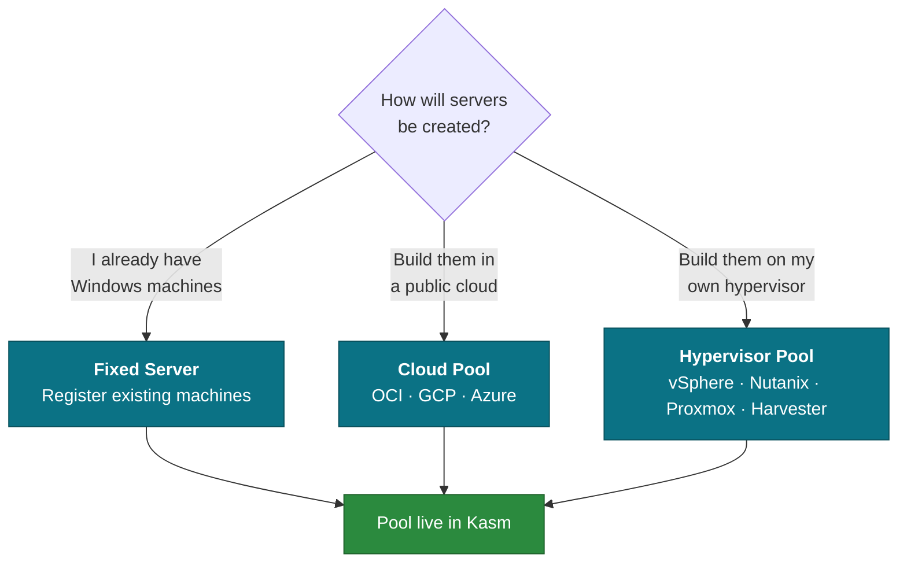

# Quick start

Get Kasm Windows Studio running and deploy your first Windows pool. Budget about
20 minutes, most of which is waiting for Windows VMs to build.

**Before you begin you need:** a Linux host with Docker, a Kasm Workspaces deployment you
administer, and a Windows VM template on one of the supported providers.

---

## 1. Get the container

```bash
mkdir kasm-windows-studio && cd kasm-windows-studio

curl -fsSLO https://raw.githubusercontent.com/KasmInnovation/Kasm-windows-studio/main/docker/docker-compose.yml
curl -fsSL  https://raw.githubusercontent.com/KasmInnovation/Kasm-windows-studio/main/docker/.env.example -o .env
```

## 2. Generate the master key

This key encrypts every credential the appliance stores. The container will not start
without it, and **it cannot be changed later** without losing access to stored
credentials.

```bash
sed -i "s|APPLIANCE_MASTER_KEY=REPLACE_ME|APPLIANCE_MASTER_KEY=$(openssl rand -base64 32)|" .env
```

Back up the `.env` file now, before you go any further.

If administrators will reach the UI by hostname rather than `localhost`, set that name
too so the generated certificate matches:

```bash
sed -i "s|TLS_COMMON_NAME=localhost|TLS_COMMON_NAME=studio.example.com|" .env
sed -i "s|ALLOWED_ORIGINS=https://localhost:8443|ALLOWED_ORIGINS=https://studio.example.com:8443|" .env
```

## 3. Start it

```bash
docker compose up -d
```

First start generates a self-signed certificate, applies the database schema, and comes
up in roughly 20 seconds. Watch it become healthy:

```bash
docker compose ps
```

```
NAME         SERVICE     STATUS
appliance-1  appliance   Up 22 seconds (healthy)
redis-1      redis       Up 23 seconds
```

If `appliance` doesn't reach `healthy`, see [Troubleshooting](troubleshooting.md).

---

## 4. First-run setup

Open **https://localhost:8443** (or your own hostname). The certificate is self-signed,
so your browser will warn — that's expected for evaluation. Replace it with a real
certificate before wider use; see [Installation](installation.md#tls-certificates).

The setup wizard has five steps:

| Step | What to enter |
| --- | --- |
| **1. Database** | Keep the default. SQLite is the only driver in the preview image. |
| **2. Kasm API** | Your Kasm URL and an API key ID + secret. See [permissions](installation.md#kasm-api-permissions). |
| **3. Admin Account** | The local administrator you'll sign in as. Use a strong password. |
| **4. Active Directory** | Optional. Configure now for AD sign-in, or skip and add it later. Requires an **LDAPS** URL — see [Active Directory](active-directory.md). |
| **5. Finish** | Review and complete. |

> [!NOTE]
> **Always create the local administrator in step 3, even if you configure AD.** It is
> your way back in if the directory is unreachable. By default the appliance fails
> closed — if AD cannot be reached, nobody signs in, including AD administrators.
> See [Active Directory](active-directory.md#if-the-directory-is-unreachable).

The appliance verifies the Kasm credential before it lets you finish. If verification
fails, the most common causes are a missing permission on the API key or the appliance
being unable to reach the Kasm URL from inside the container.

---

## 5. Deploy your first pool

From the dashboard, choose **New Deployment** and pick a workflow:



**Start with Fixed Server if you have a Windows machine handy** — it's the shortest path
to a working session and it validates your Kasm credential, network reachability and
Desktop Service install without waiting on VM provisioning.

The wizard walks through pool identity, provider and connection settings, sizing,
startup scripts, service configuration, and a review step before it changes anything in
Kasm. Nothing is created until you confirm on the final step.

Full detail on each workflow and what it creates:
**[Deployment workflows](workflows.md)**.

---

## 6. Verify

After deployment completes, confirm in **both** places:

1. **In Studio** — the stack appears in the Windows Stacks list with its servers.
2. **In the Kasm admin UI** — the pool, workspace and (for autoscale) the autoscale
   config exist under Infrastructure.

Checking Kasm directly matters. Studio reports what the API told it; seeing the objects
in Kasm's own interface confirms they landed the way you intended.

---

## Next steps

- [Trust Profiles](trust-profiles.md) — keep user profiles across disposable VMs
- [Configuration](configuration.md) — environment variable reference
- [Installation](installation.md) — production hardening, backups, upgrades

## Stopping and removing

```bash
docker compose down            # stop, keep all data
docker compose down -v         # stop and DELETE the database and certificates
```

`-v` is irreversible. It removes stored credentials and every stack Studio knows about.
It does **not** remove anything already created in Kasm — clean those up in Kasm first if
you want a true reset.
