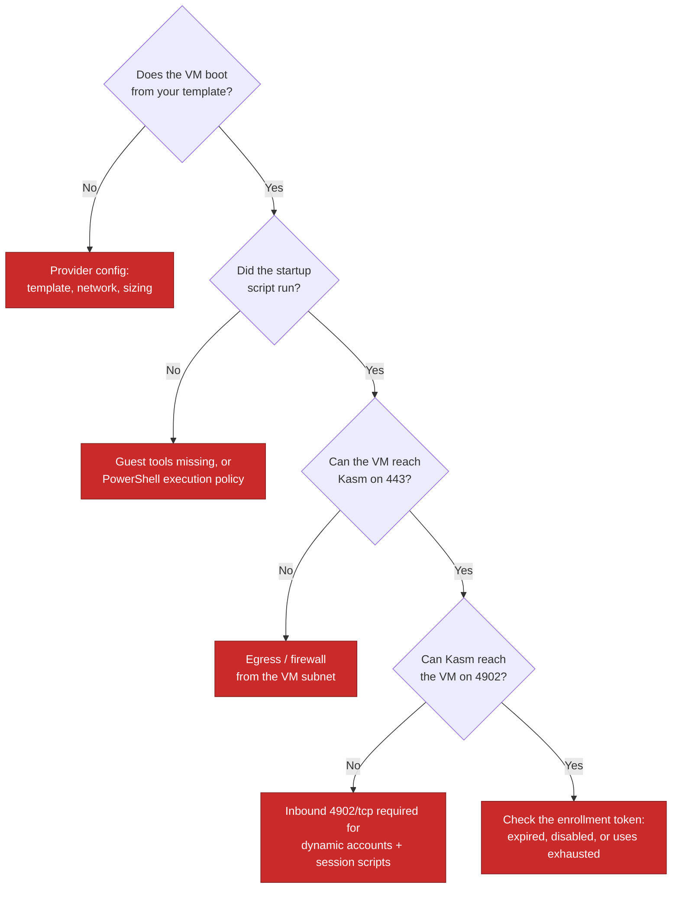

# Troubleshooting

## Reading the logs

```bash
docker compose logs -f appliance        # API and task worker
docker compose logs --tail=200 appliance
docker compose ps                       # health status
```

Health is reported by the container itself, so `docker compose ps` distinguishes
"running" from "actually serving".

---

## The container won't start

### `FATAL: APPLIANCE_MASTER_KEY is not set`

The `.env` file is missing, in the wrong directory, or still contains the placeholder.
It must sit beside `docker-compose.yml`.

```bash
grep APPLIANCE_MASTER_KEY .env       # must not be REPLACE_ME
```

### `FATAL: /data is not a writable directory`

The `kasm-data` volume isn't writable by the appliance's account. Usually a leftover
from a hand-created bind mount. Prefer the named volume in the shipped compose file.

### It exits shortly after start, mentioning migrations

A schema migration failed, and the container stops rather than running in a half-migrated
state. Capture `docker compose logs appliance` and open an issue — include the preview
tag you're running and the tag you upgraded from.

### It starts, then immediately restarts

Almost always TLS. The appliance needs both a certificate and a key at
`TLS_CERT_PATH` / `TLS_KEY_PATH`, and the key must be readable by uid 1000:

```bash
VOL=$(docker volume ls -q | grep ssl-data)
docker run --rm -v "$VOL":/ssl alpine:3.20 stat -c '%n uid=%u mode=%a' /ssl/cert.pem /ssl/key.pem
```

Expect `uid=1000` and `mode=600` on the key. Fix with the commands in
[Installation](installation.md#tls-certificates).

---

## The UI loads but everything fails

**Symptom:** the page renders, then lists are empty, saves fail, or the browser console
shows CORS errors.

`ALLOWED_ORIGINS` doesn't include the URL you're actually using. It must match scheme,
host and port exactly — `https://studio.example.com:8443` is a different origin from
`https://studio.example.com` or `https://10.0.0.5:8443`.

```bash
sed -i 's|^ALLOWED_ORIGINS=.*|ALLOWED_ORIGINS=https://studio.example.com:8443|' .env
docker compose up -d
```

---

## Kasm credential verification fails

Work outward from the container:

```bash
# 1. Can the container resolve and reach Kasm at all?
docker compose exec appliance curl -kfsS https://kasm.example.com/api/__healthcheck
```

If that fails it's DNS or routing, not credentials. A hostname that resolves on the
Docker host does not necessarily resolve inside the container.

If it succeeds but verification still fails:

- Check the API key has every permission in
  [the table](installation.md#kasm-api-permissions) — a missing one fails the whole check.
- Confirm you pasted the **API key ID** and **secret** into the right fields.
- If you supplied only a key and no administrator credentials, some features are
  unavailable by design; see the note in that section.

---

## A deployment reported success but nothing appears in Kasm

Check the Kasm admin UI directly — Studio reports what the API returned.

If the objects genuinely aren't there, the usual causes are:

| Cause | How to tell |
| --- | --- |
| Insufficient API permission | The object type that's missing maps to a permission you didn't grant |
| The workspace has no group assigned | The workspace exists in Kasm but no user can see it |
| A list is cached | Kasm caches some lists briefly; use the Refresh control rather than reloading the page |

**A workspace with no group assigned is the most common "it worked but nobody can see
it".** Assign a group under Pools → workspace visibility.

---

## Windows VMs build but never join the pool



Port **4902/tcp inbound to the VM from Kasm** is the one people miss. Enrollment can
succeed without it while dynamic user accounts and session scripts quietly do not work.

---

## Storage mappings mount nothing

The mapped drive is absent or empty, and no error appears anywhere.

1. **Is WinFsp installed in the template?** Kasm's mapping uses rclone, which needs the
   WinFsp driver. This is the most common cause by a wide margin.
2. **Does the mapping have a mount target set?** A mapping without one runs at session
   start and exits cleanly having mounted nothing.
3. **Is an rclone process running in the session?** If not, the mount never started.

---

## Nobody can sign in after configuring Active Directory

Studio **fails closed** by default: if the directory cannot be reached, AD sign-in is
unavailable rather than quietly falling back to local passwords.

Sign in with the **local administrator account** created during first-run setup — that
account always works — then fix the directory configuration.

| Message | Cause |
| --- | --- |
| `Plain LDAP (ldap://) is disabled` | Use `ldaps://`. |
| `CERTIFICATE_VERIFY_FAILED` | `LDAP_CA_CERT_FILE` unset, not mounted into the container, or the wrong CA. |
| Verify fails with the correct CA | The URL hostname must match the DC certificate's subject. Use the DC's name, not its IP. |
| `Failed to decrypt stored LDAP bind password` | `APPLIANCE_MASTER_KEY` changed since the config was saved. Re-enter the bind password. |

The sign-in page shows the same message for a bad password and an unknown user by
design. **The audit log has the specific reason** — check there rather than guessing
from the UI.

Full detail: [Active Directory](active-directory.md#troubleshooting).

---

## An AD user signs in but has the wrong permissions

Their AD groups didn't match any mapping, so they got `readonly`.

Mappings are evaluated in order and **first match wins**, so a user in both your Admins
and Operators groups gets whichever is listed first. Check the exact DN in the user's
`memberOf` — both the full DN and the bare group name will match, but a typo in either
will not.

---

## Profiles aren't persisting

See [Trust Profiles → Verifying it works](trust-profiles.md#verifying-it-works).

The one that catches people: **session scripts are written when the Trust Profile is
saved or assigned**, not read at session time. After editing a profile, re-save or
re-assign it so pools pick up the change.

---

## Starting over

```bash
docker compose down -v      # deletes the database, credentials and certificates
docker compose up -d
```

This does **not** remove pools, workspaces or servers already created in Kasm. Clean
those up in the Kasm admin UI first, or the fresh install will find objects it has no
record of.

---

## Reporting a problem

Open an issue with:

- The preview tag you're running (`IMAGE_TAG` from `.env`, or
  `docker image inspect --format '{{index .RepoDigests 0}}' <image>`)
- What you expected and what happened
- Relevant log lines

**Redact hostnames, IP addresses, usernames and API keys before posting** — this
repository is public.
