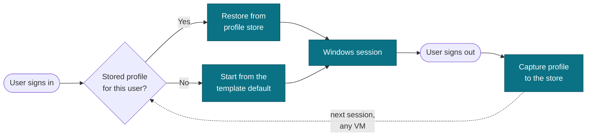
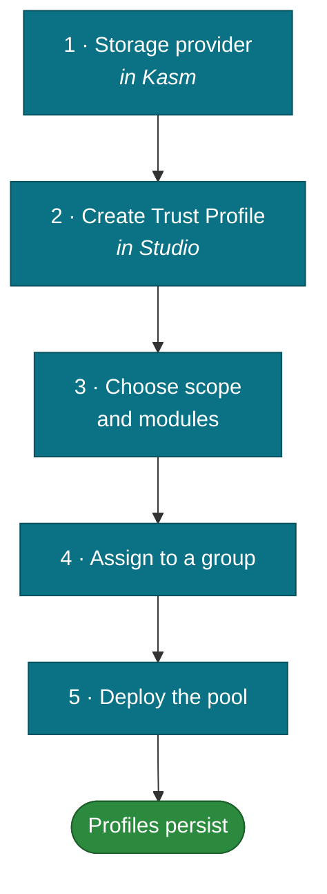

# Trust Profiles

On an autoscaled pool the VM a user gets is disposable — it may not exist an hour later.
Without help, every session starts from a fresh Windows profile: no desktop layout, no
application settings, no mapped drives.

A **Kasm Trust Profile (KTP)** captures the user's profile at sign-out and restores it at
sign-in, keyed to the person rather than the machine. The user gets continuity; you keep
disposable infrastructure.



Because the store is keyed on the user, the next session can land on a completely
different VM in a different provider and still restore the same profile.

---

## What you need

| Requirement | Why |
| --- | --- |
| **Object storage** (S3-compatible) | Where profiles are kept |
| **A storage provider configured in Kasm** | How Kasm reaches that bucket |
| **WinFsp installed in the Windows template** | Kasm's storage mapping uses rclone, which needs the WinFsp driver |

> [!IMPORTANT]
> **WinFsp is the prerequisite people miss.** Without it, a server enrols and reports
> healthy while every storage mapping silently fails to mount. The symptom is an empty
> or missing mapped drive with no error anywhere. Install WinFsp in the template before
> you build the pool.

---

## Setting one up

1. **Configure the storage provider in Kasm** — bucket, endpoint and credentials.
2. **In Studio, create a Trust Profile** — give it a name and select that provider.
3. **Choose what's captured** — the profile scope, and any application modules you want
   included.
4. **Assign it** to the group whose members should get persistent profiles.
5. **Deploy or redeploy** the pool so the session scripts are applied.



> [!NOTE]
> Session scripts are written onto the profile when it is saved or assigned — they are
> not read from disk at session time. **After changing a Trust Profile, re-save or
> re-assign it** so existing pools pick up the new scripts.

---

## Where profiles are stored

Profiles are stored under a dedicated prefix inside the bucket, one entry per user:

```
your-bucket/
└── ktp/
    ├── <user-key-a>/
    ├── <user-key-b>/
    └── <user-key-c>/
```

The `ktp/` prefix matters. **The same bucket is typically what Kasm mounts as the
session storage mapping**, so anything at the bucket root appears inside every user's
mapped drive. Keeping profiles under a prefix keeps them out of that view.

Whether one user could read another's stored profile depends on the credentials on your
Kasm storage mapping, not on Studio. If profiles contain anything sensitive, scope that
credential so users cannot enumerate the whole bucket — or use a separate bucket for
profiles and mapped storage.

---

## Verifying it works

Run one session end to end before rolling it out:

1. Sign in, change something visible — desktop layout, a pinned application.
2. Sign out fully. Wait for the session to close.
3. Sign in again, ideally landing on a different VM.
4. Confirm the change survived.

If it didn't, check in this order:

| Check | What it tells you |
| --- | --- |
| Is WinFsp present in the template? | The single most common cause |
| Is the storage mapping assigned to the group? | No mapping, nothing to save to |
| Does the mapping have a mount target set? | A mapping without one mounts nothing and still exits cleanly |
| Is an rclone process running in the session? | Confirms the mount actually happened |
| Was the Trust Profile re-saved after its last edit? | Scripts are written at save time |

See [Troubleshooting](troubleshooting.md) for reading the session logs.
