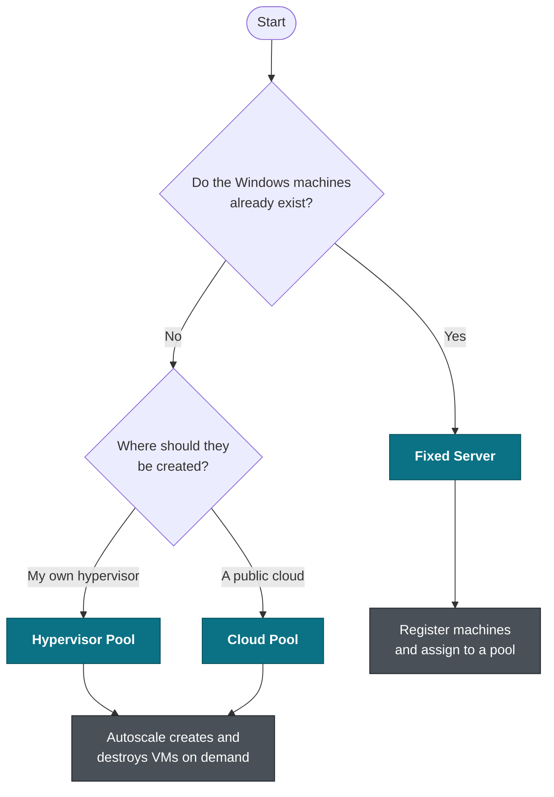
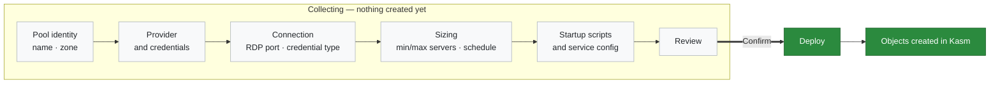
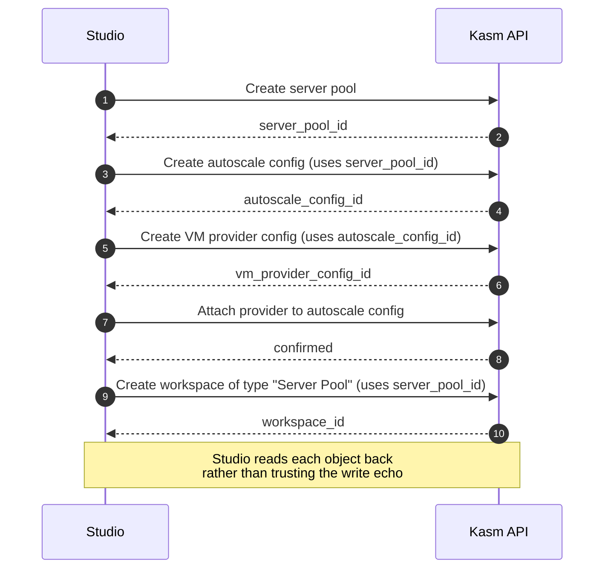
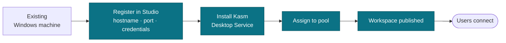
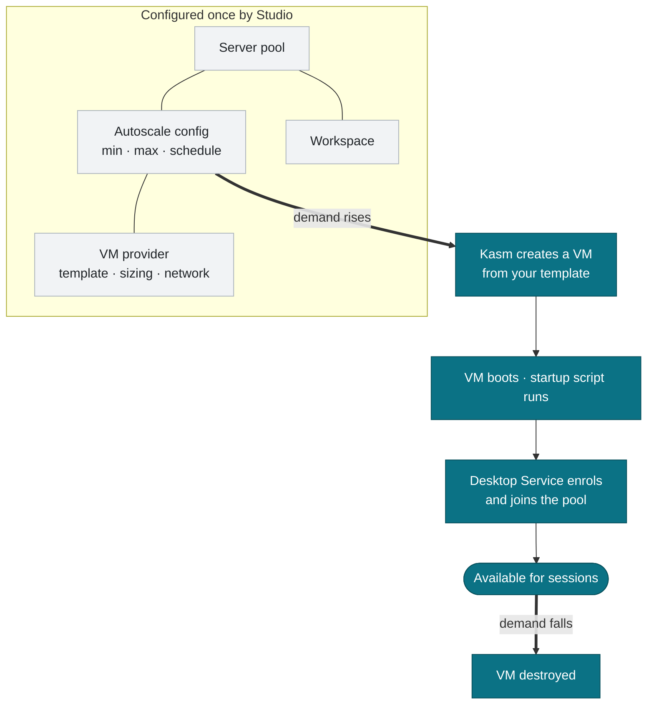
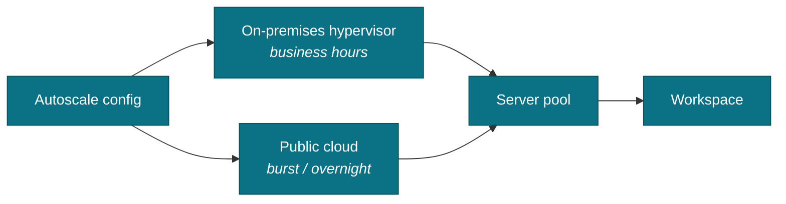
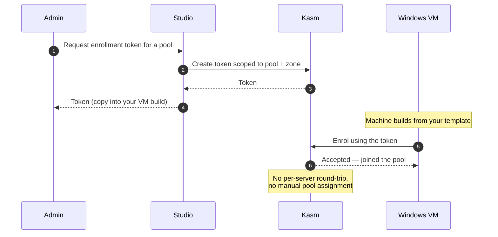

# Deployment workflows

Studio offers three ways to get Windows capacity into Kasm. They share the same wizard
and differ in who creates the machines.

| Workflow | Machines created by | Use when |
| --- | --- | --- |
| **Fixed Server** | You, already | You have existing Windows machines — physical, or VMs you manage yourself |
| **Hypervisor Pool** | Studio, on your hypervisor | vSphere, Nutanix Prism, Proxmox VE or Harvester, scaling on demand |
| **Cloud Pool** | Studio, in a public cloud | Oracle Cloud, Google Cloud or Azure Virtual Desktop, scaling on demand |

Choosing between them:

---

## What the wizard does, in order

Nothing is created in Kasm until the final confirmation. Up to that point the wizard is
collecting configuration into a draft you can leave and come back to.

### Deploy order matters

The objects have dependencies, so the deploy runs them in a fixed sequence. Each step
consumes an identifier produced by an earlier one — this is the sequencing Studio exists
to get right.

For **Fixed Server** the chain is shorter: create the pool, register each server, assign
them to the pool, then create the workspace. There is no autoscale config or VM provider.

---

## Fixed Server

Registers Windows machines you already run, so Kasm can broker sessions to them.

**Good for:** physical workstations, a handful of long-lived VMs, proving the Kasm
credential and network path before committing to autoscale.

**Note:** capacity is exactly what you registered. Nothing scales.

---

## Hypervisor and Cloud Pools

Both use Kasm's autoscale engine. Studio configures the pool, the scaling policy and the
provider, then Kasm creates and destroys VMs to match demand.

The difference between the two workflows is only the provider and its fields —
datastore and network for a hypervisor, compartment and shape for a cloud. Everything
downstream is identical.

### Multiple providers on one pool

An autoscale config can carry more than one VM provider, each with its own schedule. A
common pattern is on-premises capacity during business hours with cloud burst overnight.

Add further providers after the first deployment from **Pools → VM Providers**.

---

## Server enrollment tokens

A Windows machine has to prove to Kasm that it's allowed to join. There are two ways,
and the difference is worth understanding because they are not interchangeable.

| | Per-server registration token | Server enrollment token |
| --- | --- | --- |
| Scope | One machine | Reusable, up to a maximum count |
| Carries pool/zone settings | No | Yes |
| How you get it | Create the server record, save, reopen it, enable Desktop Service, save again | Minted once, up front |
| Good for | A one-off machine | Any repeatable build |

The enrollment token exists to remove the multi-save round-trip. Because it carries the
pool and zone, machines that enrol with it land in the right place with no manual
assignment.

Treat the token as a credential: it authorises machines to join your deployment. Set a
sensible maximum use count and expiry, and disable it when the build campaign is done.

---

## After deployment

- **Windows Stacks** lists everything Studio has deployed, with per-server status.
- **Pools** manages pools, VM providers and workspace visibility outside the wizard.
- Group assignment controls who sees the published workspace — a workspace with no group
  assigned is visible to nobody, which is the usual reason a deployment "worked" but
  nobody can find it.

Always confirm the result in the Kasm admin UI as well as in Studio. Studio reports what
the API returned; Kasm's own interface is the ground truth.
